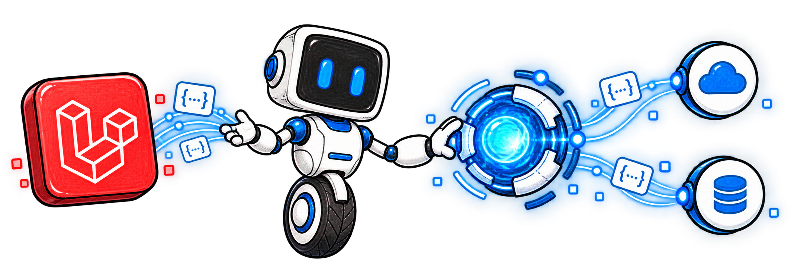
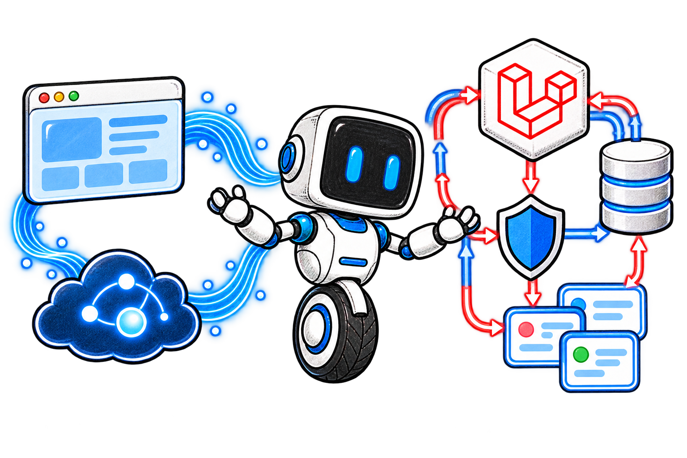
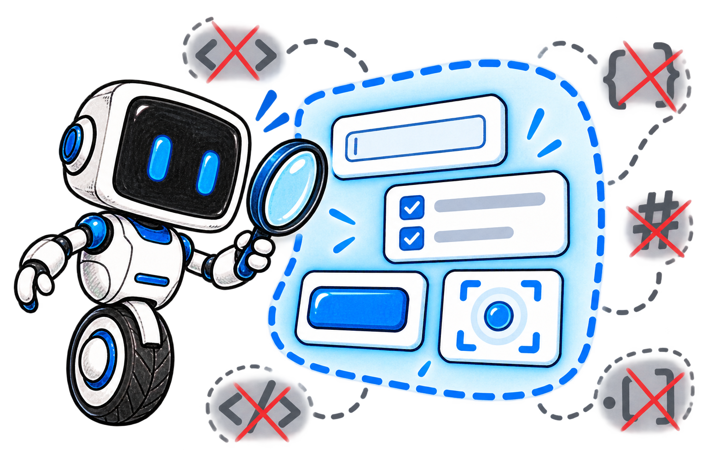
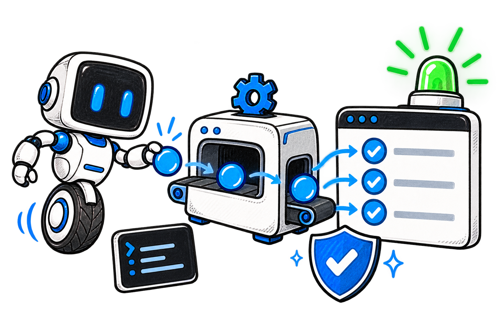

<p align="center">
  
</p>

<h1 align="center">Laravel Realtime Agent</h1>

<p align="center">
  Provider-agnostic realtime agents with Laravel-authoritative state, goals, tools, and semantic UI control.
</p>



Laravel Realtime Agent is an installable Composer package for Laravel 12 and 13. It keeps audio and realtime events close to the provider while every consequential operation—state mutation, goal completion, tool execution, authorization, confirmation, UI action, transcript, and usage record—passes through Laravel.

The package ships a private, framework-neutral TypeScript runtime in the same Composer distribution. The default provider is deterministic and free: no API key is required to develop or run the standard test suite.

## Why this package exists

A conversational provider is good at low-latency voice. It should not be the authority for your application.

This package separates the two concerns:

- the provider carries realtime media and translates vendor events;
- Laravel owns the canonical snapshot, revision checks, policies, tool broker, goals, ordered transcript, cost audit, and signed UI commands;
- the browser exposes only a semantic `Surface`, never a raw DOM dump or arbitrary selectors;
- OpenAI and ElevenLabs IDs remain inside their adapters, outside application code.



## Requirements

- PHP 8.2 or newer
- Laravel 12 or 13
- Node.js 20 or newer when bundling the browser client
- a database supported by Laravel
- HTTPS for browser microphone access

## Install in a Laravel application

For the current local checkout:

```bash
laravel new realtime-agent-demo
cd realtime-agent-demo
composer config repositories.realtime-agent path /Users/marco/packages/agents-full-duplex-ui-bridge
composer require agents-full-duplex/laravel-realtime-agent:@dev
php artisan realtime-agent:install
php artisan migrate
npm install ./vendor/agents-full-duplex/laravel-realtime-agent
npm run build
```

Set the application to the Fake Provider in `.env`:

```dotenv
APP_URL=https://realtime-agent-demo.test
REALTIME_AGENT_PROVIDER=fake
```

Open the project as `realtime-agent-demo.test` with Laravel Herd and enable HTTPS for that site. Do not add OpenAI or ElevenLabs credentials for the standard test path.

The install command publishes:

- `config/realtime-agent.php`;
- six timestamped migrations, without duplicating an already installed migration;
- the compiled browser runtime under `public/vendor/realtime-agent`.

Use `--force` only when you intentionally want to refresh published configuration, migrations, and assets.

## Handoff

This repository ships an installable Codex skill containing the complete integration manual. After requiring the package in a target Laravel application, install or refresh the skill with:

```bash
realtime_agent_skill_dir="${CODEX_HOME:-$HOME/.codex}/skills/install-laravel-realtime-agent"
mkdir -p "$realtime_agent_skill_dir"
cp -R vendor/agents-full-duplex/laravel-realtime-agent/skills/install-laravel-realtime-agent/. "$realtime_agent_skill_dir/"
```

Open a new Codex task and invoke `$install-laravel-realtime-agent`. During local package development, the source skill is available at `skills/install-laravel-realtime-agent` and can be copied directly from this checkout.

Package maintainers can also install the release-review skill:

```bash
realtime_agent_release_skill_dir="${CODEX_HOME:-$HOME/.codex}/skills/release-laravel-realtime-agent"
mkdir -p "$realtime_agent_release_skill_dir"
cp -R skills/release-laravel-realtime-agent/. "$realtime_agent_release_skill_dir/"
```

Invoke `$release-laravel-realtime-agent` to audit a candidate, run the complete offline-safe gate, prepare SemVer and changelog metadata, create the atomic local release commit, and add an annotated `v<version>` tag. The skill never pushes, publishes, or runs paid provider tests without a separate explicit request.

Copy the following prompt into AskMyDoc or any other Laravel project when handing the integration to another agent:

````text
Integra in questo progetto Laravel il pacchetto `agents-full-duplex/laravel-realtime-agent`.

La sorgente locale del pacchetto è `/Users/marco/packages/agents-full-duplex-ui-bridge`. Se il pacchetto è già disponibile da un repository Composer configurato, usa invece la versione richiesta dal progetto. Prima di modificare qualsiasi file, ispeziona versioni PHP/Laravel/Node, autenticazione, modelli, route, Vite, test, stato Git e dominio Laravel Herd esistente. Il pacchetto richiede PHP 8.2+, Laravel 12–13 e Node 20+.

Se disponibile, usa la skill `$install-laravel-realtime-agent` e leggi integralmente il suo `references/integration-manual.md`. Altrimenti segui queste istruzioni come contratto operativo:

1. Installa da path locale con `composer config repositories.realtime-agent path /Users/marco/packages/agents-full-duplex-ui-bridge` e `composer require agents-full-duplex/laravel-realtime-agent:@dev`, oppure usa il normale `composer require agents-full-duplex/laravel-realtime-agent` se il registry è già configurato. Esegui `php artisan realtime-agent:install`, `php artisan migrate`, `npm install ./vendor/agents-full-duplex/laravel-realtime-agent` e la build frontend del progetto. Non usare `--force` salvo refresh intenzionale.
2. Parti con `REALTIME_AGENT_PROVIDER=fake`: deve funzionare senza chiavi, costi o chiamate esterne. Non inventare credenziali e non eseguire smoke test live a pagamento senza una richiesta esplicita.
3. Crea ogni sessione esclusivamente da codice PHP autenticato tramite `RealtimeAgent::make($key)`, dichiarando istruzioni, contesto applicativo limitato ai dati autorizzati, goal, allowlist di tool, Surface, livello di interazione e `startFor($request->user())`. Non creare un endpoint browser generico che accetti istruzioni, tool o owner arbitrari.
4. Per AskMyDoc, collega la sessione al documento autorizzato e passa solo una rappresentazione testuale sicura e limitata. Usa `Goal::make(...)` per gli obiettivi. Abilita soltanto i tool incorporati necessari (`RuntimeStateGet`, `UpdateWorkingMemory`, `UpdateGoal`, `ExecuteUiAction`, `FinishSession`) e gli eventuali tool applicativi, ciascuno con schema, handler a classe, policy e conferma adeguata.
5. Passa `$started->connection()` alla view. In Blade aggiungi il meta CSRF e serializza il descriptor come JSON. Nel runtime TypeScript importa `RealtimeAgentClient`, `LaravelControlTransport`, `SurfaceRegistry`, `DomSurfaceAdapter`, `FakeRealtimeDriver`, `OpenAILiveDriver` ed `ElevenLabsRealtimeDriver` da `@agents-full-duplex/realtime-agent-client`; scegli il driver esclusivamente da `descriptor.provider` e connetti da un gesto utente quando serve il microfono.
6. Registra una Surface semantica con ID stabili e sole azioni ammesse usando `data-agent-id`, `data-agent-label`, `data-agent-actions` oppure `client.surface.register(...)`. Non esporre dump del DOM, HTML, segreti, selector CSS arbitrari o codice eseguibile. `Observe` deve restare senza azioni UI; `Guide` e `Operate` possono usare soltanto azioni semantiche registrate e non sostituiscono policy/conferme.
7. Mantieni le route di controllo sotto `/realtime-agent` protette da `web` e `auth`. Conserva il controllo di ownership predefinito o configura una Gate ability applicativa in `security.authorization_ability`. Non disabilitare `security.require_authorization` in ambienti usati da utenti.
8. Rispetta revisioni ottimistiche, validazione schema, idempotenza, rate limit, conferme e token firmati dei comandi UI. Non aggiungere scorciatoie provider-specifiche che aggirino il Tool Broker Laravel.
9. Supporta i tre provider: Fake per sviluppo/test; OpenAI con GPT-Live WebRTC e chiave soltanto server-side; ElevenLabs con signed URL ottenuto dal backend. Per OpenAI, `switchToText()` chiude il trasporto vocale fatturato e continua a testo tramite Responses conservando sessione, goal e cronologia; `switchToVoice()` reidrata una nuova connessione vocale. `disconnect()` chiude solo il trasporto, mentre `finish()` completa la sessione Laravel.
10. Mantieni l'audit: messaggi ordinati in `realtime_agent_messages`, utilizzi/costi in `realtime_agent_usage`, tool in `realtime_agent_tool_calls` ed eventi append-only. Esponi l'audit solo all'owner con `client.audit()`, con `GET /realtime-agent/sessions/{session}/audit` o da PHP tramite `AgentSessionManager::resume($id)->audit()`. Usa gli eventi `AgentMessageRecorded` e `AgentUsageRecorded` per ledger/data warehouse. Per ElevenLabs esegui la riconciliazione post-call quando richiesta; distingui sempre costi `estimated` e provider-final.
11. Configura il provider live solo tramite ambiente. OpenAI usa `OPENAI_API_KEY`, `OPENAI_LIVE_MODEL=gpt-live-1`, `OPENAI_LIVE_BACKEND_MODEL=gpt-5.6-terra`, `OPENAI_LIVE_VOICE=marin`, `OPENAI_LIVE_STORE=false`. ElevenLabs usa `ELEVENLABS_API_KEY` ed `ELEVENLABS_AGENT_ID`. Dopo ogni cambio esegui `php artisan config:clear` e `php artisan realtime-agent:doctor`.
12. Usa il dominio Laravel Herd già associato alla cartella del progetto, con schema esistente e HTTPS per il microfono; non avviare `php artisan serve`. Verifica almeno doctor, stato migrazioni, build frontend, test applicativi, connessione Fake, testo in/out, sincronizzazione Surface, audit, rifiuto dell'accesso da un altro utente e differenza tra disconnect e finish. Se modifichi anche la sorgente del pacchetto, esegui inoltre `composer check`, `npm run check`, `npm run test:e2e` e i validatori delle skill prima di consegnare.

Adatta nomi di controller, modelli, campi, route e componenti alle convenzioni già presenti senza inventare API del dominio. Preserva le modifiche preesistenti non correlate. Alla fine elenca file modificati, provider scelto, punto di creazione della sessione, Surface/tool/policy configurati, percorso dell'audit e risultati esatti dei test; dichiara esplicitamente quali prove live non sono state eseguite.
````

The repository-level `AGENTS.md` requires this Handoff and the bundled skill to be updated whenever installation, public APIs, provider behavior, security, audit, or verification changes.

### Anonymous case studies

The bundled skill contains three reusable, fictionalized patterns in [case-studies.md](skills/install-laravel-realtime-agent/references/case-studies.md). They are not references to, documentation for, or compatibility claims about any external product:

- **Adaptive-learning session** — ordered goals, retrieval and quiz tools, React chat, transcript projection, and billing limits.
- **Connected-environment controller** — authorization, revisioned device commands, confirmations, presentation-only Surface actions, and operational audit.
- **Revisioned creative workspace** — method objectives, card-based UI, dual revision checks, conversation projection, and broadcast patches.

When a target resembles one of these anonymous patterns, append this sentence to the generic prompt above:

```text
Il progetto target assomiglia al caso studio adaptive-learning/connected-environment/revisioned-creative-workspace: usa la sezione corrispondente di `skills/install-laravel-realtime-agent/references/case-studies.md`, tratta tutti i nomi come segnaposto e implementa prima il percorso Fake senza rimuovere il flusso esistente finché transcript, tool, autorizzazione e audit non hanno copertura equivalente.
```

## Create a session

Sessions are created by trusted application code, never by a generic browser endpoint:

```php
use AgentsFullDuplex\RealtimeAgent\Enums\InteractionLevel;
use AgentsFullDuplex\RealtimeAgent\Facades\RealtimeAgent;
use AgentsFullDuplex\RealtimeAgent\Goal;
use AgentsFullDuplex\RealtimeAgent\Tools\ExecuteUiAction;
use AgentsFullDuplex\RealtimeAgent\Tools\RuntimeStateGet;
use AgentsFullDuplex\RealtimeAgent\Tools\UpdateGoal;
use AgentsFullDuplex\RealtimeAgent\Tools\UpdateWorkingMemory;

$started = RealtimeAgent::make('lessons.teacher')
    ->instructions('Teach the current lesson and complete goals only with evidence.')
    ->context([
        'lesson_id' => $lesson->getKey(),
        'source_text' => $lesson->source_text,
    ])
    ->goals([
        Goal::make('topic_1')->label('Photosynthesis')->required()->completionByAgent(true),
        Goal::make('topic_2')->label('Light-dependent phase')->required()->completionByAgent(true),
        Goal::make('topic_3')->label('Calvin cycle')->required()->completionByAgent(true),
    ])
    ->tools([
        RuntimeStateGet::class,
        UpdateGoal::class,
        UpdateWorkingMemory::class,
        ExecuteUiAction::class,
    ])
    ->surface('lesson.show')
    ->interactionLevel(InteractionLevel::Guide)
    ->allowAgentGoals(false)
    ->startFor($request->user());

return view('lessons.show', [
    'agentConnection' => $started->connection(),
]);
```

`startFor()` returns a `StartedAgentSession`. It exposes the session ID, initial state, client connection descriptor, and the normal executable session methods.

## Connect the browser runtime

Expose the descriptor as JSON in Blade:

```blade
<meta name="csrf-token" content="{{ csrf_token() }}">
<script id="agent-connection" type="application/json">
    @json($agentConnection)
</script>
```

Then register a semantic Surface and connect the client:

```ts
import {
  DomSurfaceAdapter,
  FakeRealtimeDriver,
  LaravelControlTransport,
  RealtimeAgentClient,
  SurfaceRegistry,
} from '@agents-full-duplex/realtime-agent-client';

const descriptor = JSON.parse(
  document.querySelector('#agent-connection')!.textContent!,
);
const surfaces = new SurfaceRegistry();

new DomSurfaceAdapter(document, surfaces).register('lesson.show', 'Lesson');

const client = new RealtimeAgentClient(
  surfaces,
  new FakeRealtimeDriver(),
  new LaravelControlTransport(descriptor.session_id),
);

await client.connect(descriptor);
```

The declarative adapter reads only elements explicitly marked with `data-agent-*` attributes:

```html
<input
  data-agent-id="lesson.notes"
  data-agent-label="Lesson notes"
  data-agent-actions="focus,set_value"
>
```

Programmatic registration is available through `client.surface.register(...)`. The public client also exposes `connect`, `disconnect`, `sendText`, `switchToText`, `switchToVoice`, `audit`, `refreshState`, `finish`, and `on`.

## Continue the same session in text

Switching channel does not finish the Laravel session or discard its canonical context. With OpenAI, `switchToText()` gracefully closes the billed GPT-Live voice session and subsequent messages use the configured Responses backend through Laravel. Both sides remain canonical messages in the same session:

```ts
await client.switchToText();
await client.sendText('Continue from the last point, but in writing.');

const audit = await client.audit();
console.log(audit.messages);
```

Call `switchToVoice()` to create a fresh GPT-Live WebRTC connection seeded with the saved conversation, while retaining the same Laravel session and goals. Other providers may switch modality on their existing transport. Call `disconnect()` when provider transport should stop; call `finish()` when the canonical Laravel session itself is complete.

Every persisted conversation row has a per-session sequence, role, input/output direction, text/audio modality, provider event ID, status, timestamp, and metadata. GPT-Live exposes transcript fragments rather than authoritative turns: the runtime groups nearby fragments into revisable rows, keeps user and assistant timelines independent, and preserves every original `delta`, `start_ms`, and `end_ms` inside message metadata. This avoids thousands of partial database rows without discarding the source evidence.



## Tools, confirmations, and state

Application tools use one canonical definition regardless of provider:

```php
use AgentsFullDuplex\RealtimeAgent\Confirmation;
use AgentsFullDuplex\RealtimeAgent\Enums\ToolTarget;
use AgentsFullDuplex\RealtimeAgent\Schema;
use AgentsFullDuplex\RealtimeAgent\Tool;

Tool::make('customer.search')
    ->description('Search customers available to the current user.')
    ->input([
        'query' => Schema::string()->required(),
    ])
    ->target(ToolTarget::Server)
    ->handler(SearchCustomers::class)
    ->authorize(CustomerSearchPolicy::class)
    ->confirmation(Confirmation::always());
```

Built-in tools are opt-in per session:

- `runtime.state.get`
- `working_memory.update`
- `goal.update`
- `ui.action`
- `session.finish`

State writes use optimistic `base_revision` checks. A stale mutation returns HTTP 409 with the current state. Policies return 403, invalid schemas return 422, and expired UI commands return 410. Tool calls are idempotent, events are append-only, sensitive arguments are redacted from audit by default, and UI commands carry a short-lived server signature plus a one-use nonce.

Control routes are mounted under `/realtime-agent` with `web` and `auth` middleware by default. Both prefix and middleware are configurable. Session ownership is checked again inside the controller; an application can set `security.authorization_ability` to a Laravel Gate ability for custom authorization.

## Transcript and cost audit

The database keeps three complementary audit streams:

- `realtime_agent_messages` stores finalized user and assistant text in strict session order;
- `realtime_agent_usage` stores normalized units, the original provider usage payload, a snapshot of the rate card used, amount, currency, and confidence status;
- `realtime_agent_tool_calls` stores tool lifecycle, authorization, confirmation, revisions, redacted arguments, result, and error.

Fetch the combined, versioned view from trusted PHP code:

```php
use AgentsFullDuplex\RealtimeAgent\Engine\AgentSessionManager;

$session = app(AgentSessionManager::class)->resume($sessionId);
$audit = $session->audit();

return $audit->jsonSerialize();
```

Or, for the authorized session owner, request:

```http
GET /realtime-agent/sessions/{session}/audit
```

`audit.totals` separates `estimated`, provider-confirmed `final`, and `effective` totals. `effective` prefers a final provider amount when one exists; `unpriced_records` makes unsupported units visible instead of silently valuing them at zero.

GPT-Live voice usage arrives as cumulative `session.usage.updated` snapshots. The package updates one duration record per provider session instead of summing those snapshots, then captures the last value from `session.closed`. Responses-backend token usage is recorded separately from nested `response.completed` events. The catalog currently prices `gpt-live-1` by second and `gpt-5.6-terra` by input, cached-input, and output tokens; each record keeps the exact rate-card snapshot used for its estimate. This follows the official [GPT-Live cost guide](https://developers.openai.com/api/docs/guides/voice-latency-cost?api=live), [GPT-Live pricing](https://developers.openai.com/api/docs/models/gpt-live-1), and [GPT-5.6 Terra pricing](https://developers.openai.com/api/docs/models/gpt-5.6-terra).

OpenAI includes WebRTC initialization in the reported duration: the initial 15 seconds are credited against running time and must not be added a second time. Backend tools and models remain separate cost lines, so an auditor can distinguish conversation time from task execution.

ElevenLabs sends final user/agent text over the live socket. After a call is processed, reconcile it to import missed turns and the provider-reported `cost_fiat`:

```http
POST /realtime-agent/sessions/{session}/audit/reconcile
```

That operation runs server-side, requires the configured ElevenLabs key, and uses the recorded conversation ID. See the official [conversation details response](https://elevenlabs.io/docs/api-reference/conversations/get/).

Provider session IDs are accepted only from trusted server bootstrap responses or application PHP code; the browser cannot replace the ID used for reconciliation.

External accounting, observability, or data-warehouse code can intercept records without coupling to a provider adapter:

```php
use AgentsFullDuplex\RealtimeAgent\Events\AgentMessageRecorded;
use AgentsFullDuplex\RealtimeAgent\Events\AgentUsageRecorded;
use Illuminate\Support\Facades\Event;

Event::listen(AgentUsageRecorded::class, ExportUsageToLedger::class);
Event::listen(AgentMessageRecorded::class, ExportTranscript::class);
```

For batch audits across many sessions, `AgentSessionRecord` exposes `messages`, `usageRecords`, and `toolCalls` Eloquent relations, while `provider_session_id` links each Laravel session to the provider conversation or call.

OpenAI browser-originated usage remains explicitly `estimated`, because WebRTC server events reach the browser. A trusted billing webhook or reconciliation job can call `SessionAuditManager::recordProviderCost(...)` to add a provider-confirmed `final` amount. ElevenLabs reconciliation does this automatically from its authenticated server API. Browser requests cannot supply a monetary amount.

## Providers

### Fake

`fake` is the default. It performs no external HTTP calls and exposes deterministic provider events for unit, feature, and browser tests.

### OpenAI GPT-Live

Set these only when deliberately testing the live adapter:

```dotenv
REALTIME_AGENT_PROVIDER=openai
OPENAI_API_KEY=...
OPENAI_LIVE_MODEL=gpt-live-1
OPENAI_LIVE_BACKEND_MODEL=gpt-5.6-terra
OPENAI_LIVE_VOICE=marin
OPENAI_LIVE_STORE=false
```

After adding the key locally, verify the resolved configuration without contacting OpenAI:

```bash
php artisan config:clear
php artisan realtime-agent:doctor
```

Laravel sends the browser SDP offer to `POST /v1/live/sessions`; the standard API key never leaves the server. Audio uses WebRTC while the `oai-events` data channel carries Live events. The package waits for `session.started`, uses Responses delegation for `gpt-5.6-terra`, reads function calls from nested `response.output_item.done`, and returns authorized results with `response.item.create` followed by `response.create`. Application tools still pass through the Laravel Tool Broker.

Typed values can be supplied during a voice call through Live Responses delegation. A full `switchToText()` closes the Live transport first, preventing silent voice-duration billing, then routes written messages and authorized tool results to `/v1/responses` through Laravel. Switching back to voice creates a new Live transport from canonical history. Surface changes use bounded `session.thinking.append` context, and every voice close waits for `session.closed` before releasing WebRTC so the final transcript and duration events can drain.

When a browser establishes a new provider connection for an existing Laravel session, recent canonical user/assistant messages are supplied as GPT-Live startup history. `OPENAI_LIVE_STORE` is off by default to minimize provider-side recording; enable it only when your data policy permits stored recordings and future provider-side forks. See the official [GPT-Live WebRTC guide](https://developers.openai.com/api/docs/guides/voice-webrtc?api=live), [session guide](https://developers.openai.com/api/docs/guides/live-conversations), and [delegation guide](https://developers.openai.com/api/docs/guides/live-delegation).

### ElevenLabs

```dotenv
REALTIME_AGENT_PROVIDER=elevenlabs
ELEVENLABS_API_KEY=...
ELEVENLABS_AGENT_ID=...
```

Laravel returns a signed WebSocket URL. Canonical tool schemas are materialized as ElevenLabs client tools and cached by schema hash in `realtime_agent_provider_tools`. Surface updates use contextual updates, and client tool calls always return through Laravel. See the official [signed URL](https://elevenlabs.io/docs/eleven-agents/api-reference/conversations/get-signed-url) and [client event](https://elevenlabs.io/docs/eleven-agents/customization/events/client-to-server-events) references.

No live provider test runs in the standard suite or in CI. GPT-Live has no free-tier access; the default Fake Provider and all OpenAI HTTP/WebRTC contract tests need no credential.

## Test the package itself

From this repository:

```bash
composer install
npm install
npx playwright install chromium

composer check
npm run readme:check
npm run check
npm run test:e2e
```

The commands cover:

- PHPUnit and Orchestra Testbench for state revisions, database persistence, goals, ownership, authorization boundaries, confirmations, signed UI commands, ordered transcripts, provider cost normalization/reconciliation, and idempotency;
- Pint and Larastan for PHP style and static analysis;
- TypeScript build, JSON Schema synchronization, Vitest, and jsdom for Surfaces and the command executor;
- the README validator for local image existence, raster integrity and size, SVG accessibility metadata, alt text, and the required Handoff section;
- Playwright for the full Fake Provider scenario: three goals, three UI updates, voice-to-text continuation, then a completed session.



You can inspect configuration readiness without contacting a provider:

```bash
php artisan realtime-agent:doctor
```

With the Fake Provider, the expected result is `ready (no credentials required)`.

## Test in a real Laravel app

After the local installation above:

1. Create a controller action that starts a Fake Provider session with three declared goals.
2. Pass `$started->connection()` to a Blade page.
3. Add a CSRF meta tag and at least one `data-agent-id` element.
4. Instantiate `FakeRealtimeDriver`, `LaravelControlTransport`, and `RealtimeAgentClient` as shown above.
5. Open `https://realtime-agent-demo.test` through Herd.
6. Verify `php artisan realtime-agent:doctor`, then inspect the Network panel: control calls stay under `/realtime-agent`, and no provider domain is contacted.

For a fully deterministic reference, open [examples/fake-lesson.html](examples/fake-lesson.html) through the Playwright test server by running `npm run test:e2e`.

## Architecture map

```text
Browser microphone ───────────────> realtime provider
Browser provider events <───────── realtime provider

Browser Surface ──> Laravel routes ──> State / Goal engines
Provider tool call ─> Tool Broker ───> policy + confirmation
Laravel ── signed semantic command ──> browser UI executor
Browser result ──> Laravel audit ─────> normalized provider result
Final transcript ─> ordered messages ─> text continuation / export
Provider usage ───> rate snapshot ────> estimated or final cost
```

The database is the only durable state store in v0.1. Redis, Reverb, server-side sideband connections, and dedicated React/Vue/Livewire adapters are intentionally deferred; the core browser API already works with those frameworks through programmatic Surface registration.

## Security model

- Browser, provider, route data, Surface snapshots, and tool arguments are untrusted.
- Only registered tool names, semantic targets, and action names are accepted.
- Raw CSS selectors, HTML, scripts, and JavaScript fields are rejected from Surface input.
- Authorization runs at session and tool level.
- UI commands expire, are signed with `APP_KEY`, and are removed after completion.
- Provider keys stay on Laravel; they are never serialized into the client descriptor.
- Current state is compact; events, finalized messages, usage, and tool calls remain durable for audit and debugging.
- Browser telemetry cannot set monetary amounts; only configured server pricing or trusted reconciliation can do so.

## Version scope

This repository currently implements the v0.1 development line. See [CHANGELOG.md](CHANGELOG.md) for changes and [LICENSE.md](LICENSE.md) for licensing.
